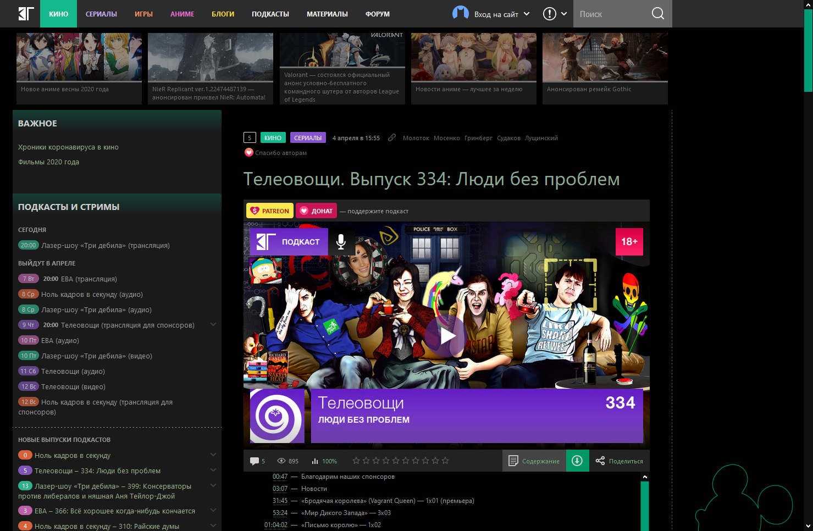

# KG-Portal Night / Kino-govno: The Dark Side of Drisney

Тёмная тема КГ для негробабок-шахтёрок, колящих уголь в ночную смену. В качестве настроек сейчас доступно два пункта:

- Затемнять картинки не под курсором: делает обложки новостной ленты на 50% темнее, пока не будет наведен курсор
- АнтиСудаков: вырезает к херам несколько блоков, в том числе сдвигая ленту на первый экран. **Этот параметр не заменяет рекламорезку**

## Как это установить

1. Установить расширение Stylus для [Firefox](https://addons.mozilla.org/en-US/firefox/addon/styl-us/), [Chrome](https://chrome.google.com/webstore/detail/stylus/clngdbkpkpeebahjckkjfobafhncgmne) или [Opera](https://addons.opera.com/en-gb/extensions/details/stylus/).
2. [Пройти по вот этой ссылке](https://github.com/kg-yemelya/KinoGovnoDark/raw/master/KinoGovnoDark.user.css)

## Как это выглядит

